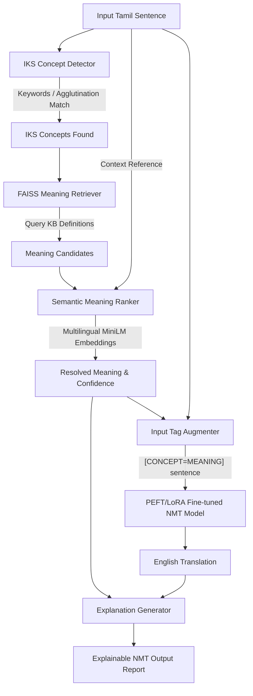
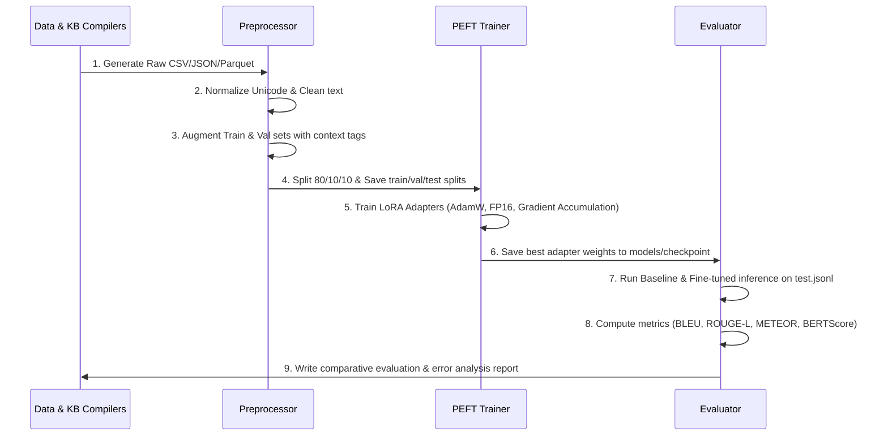

# IKS-Aware Explainable Neural Machine Translation for Classical Tamil Texts

This repository contains the complete implementation of a research-ready **IKS-Aware Explainable Neural Machine Translation (NMT) system for Classical Tamil texts using IndicTrans2 and NLLB-200**.

Existing translation systems translate words directly, losing the deep historical, cultural, and philosophical meanings embedded in Indian Knowledge System (IKS) concepts (e.g., அறம், அன்பு, அகம், புறம்). Our pipeline:
1. Detects IKS concepts in classical sentences.
2. Retrieves candidate meanings from a curated Knowledge Base.
3. Ranks candidates contextually using multilingual sentence embeddings.
4. Prepends the resolved concept meaning as context tags to the input.
5. Translates the tag-augmented sentence using a fine-tuned Seq2Seq model.
6. Generates a structured explanation of the translation.

---

## 1. Architecture & Pipeline Diagrams

### System Architecture
The system follows a context-injection design pattern:



### Execution Pipeline Workflow
The pipeline workflow governs data preparation, model training, and quantitative comparison:



---

## 2. Dataset & Knowledge Base Descriptions

### IKS Knowledge Base (`knowledge_base/`)
The database contains **200 authentic IKS concepts** curated from classical grammar (`Tolkappiyam`), ethics (`Thirukkural`), and Sangam poetry.
- **Key Fields**:
  - `concept`: English transliteration name (e.g., `Aram`).
  - `tamil`: Original Tamil representation (e.g., `அறம்`).
  - `english`: English translation and core philosophical meaning.
  - `era`: Historical era (e.g., `Sangam`, `Post-Sangam`).
  - `definition`: Conceptual description.
  - `historical_meaning`: Extensive historical meaning citing literary usage.
  - `modern_meaning`: Modern colloquial equivalent.
  - `source_reference`: Direct citation (e.g., `Thirukkural Ch 4`).
  - `confidence`: Semantic confidence index.
  - `example_sentence` / `example_translation`: Literal demonstration.

### Parallel Dataset (`datasets/`)
Contains **150 parallel sentence pairs** mapping Classical Tamil verses to English translations with full metadata:
- **Key Fields**: `id`, `source_book`, `chapter`, `verse`, `era`, `tamil`, `english`, `translator`, `iks_concepts`, `notes`, `source_url`, `license`.

---

## 3. Installation Guide

### Prerequisites
- **Python**: 3.10 or 3.11
- **CUDA-compatible GPU**: Highly recommended (e.g., RTX 3060 12GB)

### Step-by-Step Setup
1. Clone this repository to your workspace.
2. Initialize the virtual environment and install the required dependencies:
   ```bash
   python -m venv .venv
   .venv\Scripts\activate
   
   # Install PyTorch with CUDA support (adjust index URL if needed)
   pip install torch --index-url https://download.pytorch.org/whl/cu121
   
   # Install core dependencies
   pip install -r requirements.txt
   ```

---

## 4. Running the Pipeline

You can run the entire pipeline orchestrator, which compiles the datasets, preprocesses texts, performs training, and runs evaluations:

```bash
# To run the default pipeline with AI4Bharat IndicTrans2:
.venv\Scripts\python scripts/run_pipeline.py

# Since IndicTrans2 is a gated model on HuggingFace, you can run with NLLB-200 instead to avoid gated repo checks:
.venv\Scripts\python scripts/run_pipeline.py --use_nllb
```

---

## 5. Training Guide (PEFT / LoRA Fine-tuning)

Model fine-tuning is configured in `configs/config.yaml`.
- **PEFT Method**: Parameter-Efficient Fine-Tuning (PEFT) using **LoRA (Low-Rank Adaptation)**.
- **LoRA Parameters**: Rank `r = 16`, alpha `alpha = 32`, dropout `0.05`.
- **Training Settings**:
  - **Optimizer**: `AdamW`
  - **Precision**: `fp16` (Mixed Precision)
  - **VRAM Optimization**: Gradient checkpointing and gradient accumulation are enabled to fit within 12GB VRAM.
  - **Epochs**: 4 epochs.

To trigger fine-tuning separately:
```bash
.venv\Scripts\python training/finetune.py
```

---

## 6. Evaluation Guide & Comparative Metrics

The evaluation script compares the baseline model (without tag-injection) to the fine-tuned model (with tag-injection) on `test.jsonl` (10% test split).

### Metrics Tracked:
- **BLEU**: Corpus BLEU using `sacrebleu`.
- **ROUGE-L**: Recall-Oriented Understudy for Gisting Evaluation.
- **METEOR**: Metric for Evaluation of Translation with Explicit Ordering.
- **BERTScore**: Semantic similarity using contextual embeddings.

To run evaluation separately:
```bash
.venv\Scripts\python evaluation/eval.py
```

Comparative results will be output to a summary table and saved as `results/evaluation_results.json`. A detailed sentence-by-sentence qualitative error analysis is written to `results/error_analysis.md`.
